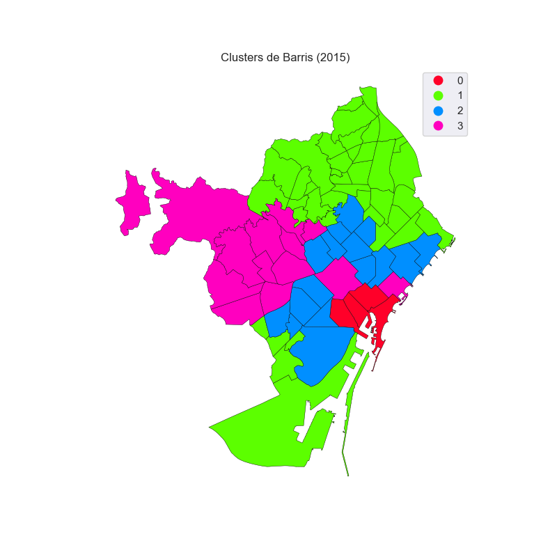
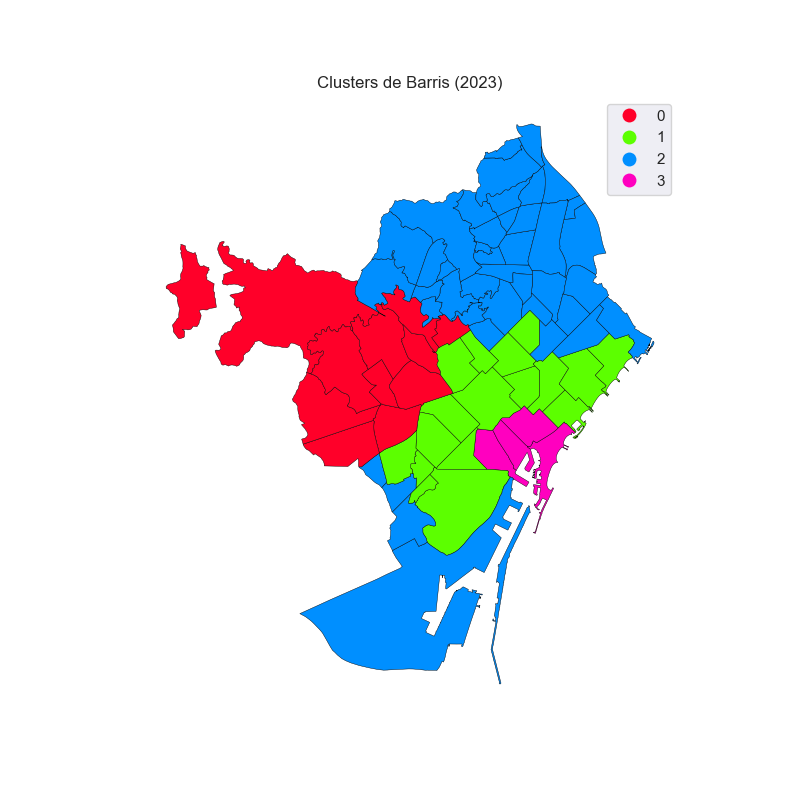
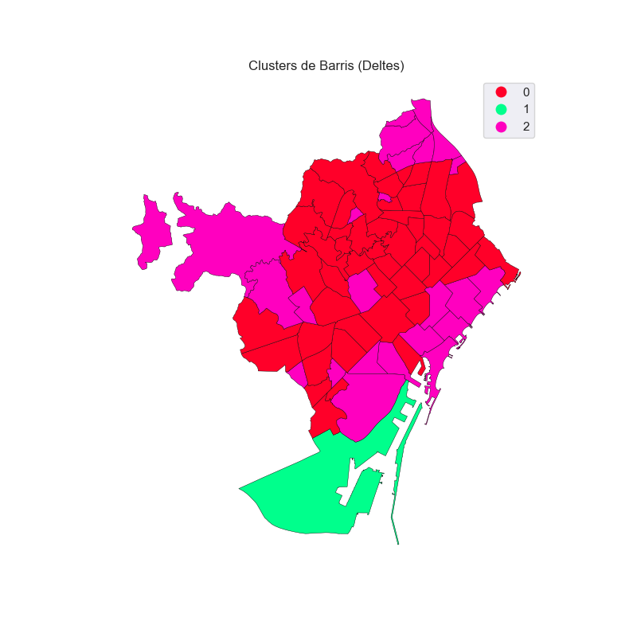

# Introducció
Treball de fi de Master centrat en la gentrificació als barris de Barcelona.
# Estructura del projecte
```bash
├── data
│   ├── raw
│   ├── processed
│   ├── dimensions
│   ├── modelling
│   ├── clustered
├── notebooks
│   └── ingestio_demografiques.ipynb
│   └── ingestio_economiques.ipynb
│   └── ingestio_urbanes.ipynb
│   └── ingestio_habitatge.ipynb
│   └── feature_engineering.ipynb
│   └── eda.ipynb
│   └── modelling.ipynb
├── results
│   └── figs
├── src
│   ├── .streamlit
│      └── config.toml
│   ├──utils
│       └── __init__.py
│       ├── config
│          └── clusters_config.json
│       └── utils.py
│       └── ingesta_dades.py
│       └── transformacions.py
│       └── visualitzacio.py
│   └── streamlit_app.py
├── requirements.txt
├── README.md
├── LICENSE
└── .gitignore
```
# Descripció
L' objectiu d'aquest treball de fi de Master, és estudiar la gentrificació a Barcelona mitjançant tècniques de ML i crear una visualització interactiva per a representar els resultats obtinguts. Per la visualització interactiva, s' ha creat la següent [Appde Streamlit](https://tfmgentrificaciobcnjr.streamlit.app/).

# Fonts
S' han integrat diferents fonts de dades de tipologia socio econòmica i d' habitatge. En el procés d' ingesta i de preprocessament, s' han combinat per obtenir un dataset per construir el model de ML i un altre per enriquir l'anàlisi de dades.
## Dades Demogràfiques
- **Població Total per barri:**[Portal de dades Barcelona](https://portaldades.ajuntament.barcelona.cat/ca/microdades/2f6e0561-30f4-44a0-8446-e27442d4754c)
- **Població per nacionalitat (Espanya, Resta UE i Resta del món) per barri:** [Portal de dades de Barcelona](https://portaldades.ajuntament.barcelona.cat/ca/microdades/ae5116f1-b265-4602-9031-edd9a45f342b)
- **Població per regió de continent per barri:** [Portal de dades Barcelona](https://portaldades.ajuntament.barcelona.cat/ca/microdades/28c20408-5bce-41db-9b83-1b85ac9b2548)
- **Població per nivell d'estudis i nacionalitat (Espanya, Resta UE i Resta del Món) per barri:** [Portal de dades de Barcelona](https://portaldades.ajuntament.barcelona.cat/ca/microdades/67f811ef-a79e-4877-ae62-77148443aa69)
- **Població per grup d'edat i nacionalitat (Espanya, Resta UE i Resta del Món) per Barri:** [Portal de dades de Barcelona](https://portaldades.ajuntament.barcelona.cat/ca/microdades/4f9dbc34-4753-4bb8-b5a6-eece9db4ea71)
## Dades Econòmiques
- **Renda neta Mitjana per Persona i barri:** [Open Data](https://opendata-ajuntament.barcelona.cat/data/ca/dataset/renda-tributaria-per-persona-atlas-distribucio)
- **Index Gini per barri:** [Open Data](https://opendata-ajuntament.barcelona.cat/data/ca/dataset/atles-renda-index-gini)
## Dades Urbanes
- **Incidents per barri:** [Portal de dades Barcelona](https://portaldades.ajuntament.barcelona.cat/ca/microdades/8181e647-083e-48ec-b8a3-68b25b91ab83)
- **Nombre de locals comercials actius per sector d’activitat i grup d’activitat:**  [Portal de dades Barcelona](https://portaldades.ajuntament.barcelona.cat/ca/estad%C3%ADstiques/fsokzddxhd)
## Dades Habitatge
- **Preu mitjà per superfície (€/m²) del lloguer d'habitatges:** [Portal de dades Barcelona](https://portaldades.ajuntament.barcelona.cat/ca/estad%C3%ADstiques/5ibudgqbrb)
- **Nombre d’habitatges d’ús turístic:** [Portal de dades Barcelona](https://portaldades.ajuntament.barcelona.cat/ca/estad%C3%ADstiques/z1wuyvykvf)
- **Nombre dels locals d'habitatge segons superfície de la ciutat de Barcelona:** [Portal de dades Barcelona](https://portaldades.ajuntament.barcelona.cat/ca/microdades/e2424d15-fdb6-4bae-b7ac-4be2a9886790)
# EDA - Validació de les dades
Es realitza una exploració de les dades focalitzada en les seves estructures i distribucions. No s' ha posat el focus en un anàlisi descriptiva, ja que es durà a terme després d' aplicar els models de clustering. En aquest cas, en una primera iteració després de crear els conjunts de dades finals en el notebook [feature_engineering.ipynb](notebooks/feature_engineering.ipynb) s' ha executat el notebook [eda.ipynb](notebooks/eda.ipynb) i s' han detectat les següents problemàtiques:

|         aspecte        | estat    |   comentari                                                                |
|:-----------------------|---------:|----------------------------------------------------------------------------|
| df_2015 i df_2023          | valid |    No presenten nuls ni duplicats i mantenen una estructura sòlida per barri.     |
| df_deltes        | revisar |    Hi ha NaN i inf en variables calculades com a canvis percentuals sobre bases inicials nul.les o inexistents.     |
| Escala de variables   | revisar  |     Renda, gini, preu i taxes per 1000 hab treballen en escales diferents. Abans del clustering caldra escalar.    |
| Outliers | revisar |    Algunes variables urbanes presenten cues llargues i outliers. És el cas de Sants Montjuic amb variables d' incidents i locas de serveis professionals. Valorar si aplicar transofrmació logaritmica.     |
| Correlacions | revisar |    Algunes variables presenten una forta correlació entre elles, com és el cas de import_euros i pct_universitaris (0.88), pct_joves i pct_pob_estrangera (0.9), delta_pct_universitaris i delta_pct_pob_estrangera_occidental (0.87).     |

Després de detectar els registres erronis en una primera execució del notebook [eda.ipynb](notebooks/eda.ipynb), s' han aplicat els canvis necessaris per tal de subsanar les dades. En aquest cas: 
- Creació de funció per calcular els deltes de manera robusta i tenint en compte valors nuls o 0 que causin nuls o infinits.
- Tractament de valors nuls en els datasets [processats](data/processed/). Són registres en els que els valors no són equivocats ni no capturats, simplement no hi existeixen. És el cas de pisos turístics en zones menys turístiques, com per exemple a Torre Baró, on és molt probable que no hi hagi, i per tant esdevenen 0.

Un cop els canvis s' han aplicat, s' ha re-executat el notebook [eda.ipynb](notebooks/eda.ipynb) i s'obtenen els següents resultats resumits:

|         aspecte        | estat    |   comentari                                                                |
|:-----------------------|---------:|----------------------------------------------------------------------------|
| df_2015 i df_2023          | valid |    No presenten nuls ni duplicats i mantenen una estructura sòlida per barri.     |
| df_deltes        | revisat |    Amb una funció més robusta s'han calculat els deltes i ah permès tractar aquells registres amb denominador 0 o nul.     |
| Escala de variables   | revisat  |     L' estandarització de les dades es durà a terme en el notbook de modelatge.    |
| Outliers | revisat |    La transformació logarítmica (si escau) per a valors absoluts, es valorarà en la part de modelatge. Per altra banda, els outliers presents en el dataset dels deltes s' usarà tècniques com Winsorize.     |
| Correlacions | revisar |   Utilitzarem PCA per reduir dimensionalitat.    |

# PCA (Principal Component Analisis)
| dataset    | n_components   | var_explicada   |   refs  |
|-----------:|:---------------|:--------|:-------------|
| df_2015 |8  | >= 0.95 | [pca_2015](results/figs/variança_explicada_15.png) |
| df_2023 |8  | >= 0.95 | [pca_2023](results/figs/variança_explicada_23.png) |
| df_2015 |11  | >= 0.95 | [pca_deltes](results/figs/variança_explicada_deltes.png) |


# Resum selecció de model i K
| dataset    | clusters   | model   | tipo_dades   | comentari                                                                                                                      |  refs  |
|---:|:-----------|:--------|:-------------|:-------------------------------------------------------------------------------------------------------------------------------|:-------|
|  df_2015 | k=3        | kmeans  | pca          | Tot i que k=3 és més simple i interpretable, k=4 ens permet diferenciar altres perfils de barris que amb k=3 queden barrejats. | [Elbow Method](results/figs/seleccio_k_2015.png) i [Silhouettes](results/figs/silhouettes_2015.png) |
|  df_2023 | k=4        | kmeans  | pca          | Segunt amb la conclusió de 2015, s’ha seleccionat una solució amb k=4 per una major diferenciació entre perfils urbans. | [Elbow Method](results/figs/seleccio_k_2023.png) i [Silhouettes](results/figs/silhouettes_2023.png) |
| df_deltes | k=3        | kmeans  | pca          | En ambdós casos, com hem vist abans k=4 és el que obté un valor més alt. No obstant, per simplicitat i interpretabilitat seleccionarem k=3, on hi ha un grup dominant i dos clusters més residuals / extrems. Mantenim amb PCA per homogeneïtat.| [Elbow Method](results/figs/seleccio_k_deltes.png) i [Silhouettes](results/figs/silhouettes_deltes_pca.png) |

# Clusters 2015
## Mapa Clusters


## Estadístiques clusters

|                                       |            0 |             1 |             2 |            3 |
|:--------------------------------------|-------------:|--------------:|--------------:|-------------:|
| poblacio_total                        | 25042.2      | 15813.5       | 35124.1       | 23846.6      |
| pct_pob_estrangera                    |     0.401387 |     0.133358  |     0.175897  |     0.126322 |
| pct_pob_estrangera_occidental         |     0.162695 |     0.0243489 |     0.0653282 |     0.06528  |
| pct_joves                             |     0.3998   |     0.263827  |     0.295617  |     0.246601 |
| pct_universitaris                     |     0.264166 |     0.141535  |     0.287426  |     0.379472 |
| import_euros                          | 10615.8      | 11779.6       | 15063.1       | 21017.1      |
| index_gini                            |    37.9739   |    31.1895    |    33.9087    |    37        |
| total_incidents_1000_hab              |    30.4572   |    52.0247    |    18.134     |    28.9664   |
| locals_restauracio_1000_hab           |    19.0015   |     3.1218    |     7.17712   |     5.52229  |
| locals_sanitaris_1000_hab             |     0.323594 |     0.425684  |     0.816629  |     1.41881  |
| locals_serveis_professionals_1000_hab |     0.600092 |     0.826749  |     1.7243    |     1.03528  |
| preu_mitja_m2                         |    12.825    |     9.05      |    11.2375    |    12.6308   |
| pisos_turistics_1000_hab              |     6.96934  |     0.770706  |    10.01      |     2.96035  |

## Observacions

Cluster 0
- Inclou barris cèntrics i gentrificats, com el Raval, el Gòtic, la Barceloneta i el Born.
- Barris turístics, amb rendes baixes, però amb un índex gini força alt, indicant desigualtats entre la mateixa població dels barris.
- Alta densitat d' estrangers, i un teixit comercial focalitzat a restauració. 
- Pressió immobiliaria, amb preu per m2 del lloguer elevat i proporció de pisos turístics moderada.

Cluster 1
- Inclou els barris de Nou Barris, Horta, Sant Andreu, etc.
- Barris carateritzats per tenir rendes més baixes i homogenees i un percentatge menor d' universitaris.
- El preu de l' habitatge és menor i la proporció de pisos turístics és molt baix.
- En general, barris perifèrics amb una forta presència de població treballadora sense indicis de gentrificació alta.

Cluster 2 — gentrificació activa / barris en transformació
- Inclou Sagrada Família, Sant Antoni, Poble-sec, Sants, Gràcia, Poblenou, etc.
- Renda intermèdia, percentatge d’universitaris moderat-alt i molta presència de pisos turístics (10 per cada 1000 habitants).
- Restauració elevada amb aguns locals orientats a ofici

Cluster 3
- Barris amb rendes superiors, i percentatge d' universitaris superiors.
- Percentatges de població estrangera baix, i una població amb un percentatge d' universitaris alt. 
- Preu de lloguer elevat, i proporció de pisos turístics baixa.
- Englova barris consolidats com són Sarria, Sant Gervasi, Pedralves, més elitistes, amb barris més de classe mitjana però en processos de transformació, com és el cas de Poblenou, Sant Antoni, etc.


# Clusters 2023

## Mapa Clusters


## Estadístiques Clusters
|                                       |             0 |             1 |             2 |            3 |
|:--------------------------------------|--------------:|--------------:|--------------:|-------------:|
| poblacio_total                        | 23798.1       | 33861.4       | 17477.2       | 26611.5      |
| pct_pob_estrangera                    |     0.167663  |     0.261791  |     0.193395  |     0.513533 |
| pct_pob_estrangera_occidental         |     0.0685891 |     0.0984038 |     0.0331555 |     0.16441  |
| pct_joves                             |     0.238383  |     0.300125  |     0.255152  |     0.428441 |
| pct_universitaris                     |     0.424067  |     0.378786  |     0.191487  |     0.30791  |
| import_euros                          | 27788.4       | 20775.3       | 15475.1       | 14977.9      |
| index_gini                            |    36.2779    |    32.4586    |    28.8087    |    35.6601   |
| total_incidents_1000_hab              |    31.2712    |    23.4096    |    55.0077    |    30.3184   |
| locals_restauracio_1000_hab           |     4.49298   |     8.84778   |     3.17971   |    14.7237   |
| locals_sanitaris_1000_hab             |     2.16051   |     1.34357   |     0.694303  |     0.515284 |
| locals_serveis_professionals_1000_hab |     0.637956  |     1.06809   |     1.16425   |     0.185438 |
| preu_mitja_m2                         |    17.1818    |    16.8529    |    13.5829    |    17.175    |
| pisos_turistics_1000_hab              |     2.88351   |    10.2105    |     0.740882  |     6.27533  |
## Observacions
Cluster 0
- Barris amb rendes elevades (27k) i un alt percentatge de població amb estudis superiors.
- Percentatge de població estrangera baix.
- Preu del lloguer elevat, però amb menor pes de l’activitat turística.
- Engloba barris elitistes i consolidats com Sarrià, Pedralbes o Sant Gervasi.

Cluster 1
- Inclou barris com Eixample, Gràcia, Poblenou o Sant Antoni.
- Barris amb rendes mitjanes-altes i alt nivell educatiu.
- Elevada presència de restauració i pisos turístics, indicant dinamisme econòmic.
- Percentatge d’estrangers i joves relativament alt.
- Representa barris en procés actiu de transformació urbana i gentrificació amb preus de lloguer elevats.

Cluster 2
- Inclou barris de Nou Barris, Horta, Sant Andreu, entre altres.
- Barris amb rendes més baixes i menor percentatge d’universitaris.
- Preu de l’habitatge més baix i baixa presència de pisos turístics.
- Major incidència d’indicadors de vulnerabilitat social.
- Representa barris perifèrics amb poca pressió gentrificadora.

Cluster 3
- Inclou barris cèntrics com Raval, Gòtic, Barceloneta i el Born.
- Alta densitat de població estrangera, especialment internacional (50%!!).
- Fort pes de la restauració i activitat turística.
- Preus elevats i alta proporció de pisos turístics.
- Rendes mitjanes-baixes però amb índex de Gini elevat, indicant desigualtat.
- Representa una gentrificació intensa de caràcter turístic.

# Clusters Deltes
## Mapa Clusters


## Estadístiques clusters
|                                             |          0 |          1 |          2 |
|:--------------------------------------------|-----------:|-----------:|-----------:|
| delta_pct_pob_estrangera                    |  0.565607  |  0.985491  |  0.28977   |
| delta_pct_pob_estrangera_occidental         |  0.363137  |  3.4234    |  0.209883  |
| delta_pct_joves                             |  0.0139006 | -0.034585  | -0.0529086 |
| delta_pct_universitaris                     |  0.272532  |  2.17926   |  0.290271  |
| delta_poblacio_total                        |  0.0550997 |  0.495544  |  0.0289926 |
| delta_import_euros                          |  0.294933  |  0.568477  |  0.361119  |
| delta_index_gini                            | -0.0515015 |  0         | -0.0848646 |
| delta_total_incidents_1000_hab              |  0.113729  | -0.249872  |  0.164951  |
| delta_locals_restauracio_1000_hab           | -0.0141325 |  0.0507407 |  0.201675  |
| delta_locals_sanitaris_1000_hab             |  0.494654  |  0         |  0.842879  |
| delta_locals_serveis_professionals_1000_hab |  0.0162183 | 13.0417    | -0.205832  |
| delta_preu_mitja_m2                         |  0.476428  |  1.0303    |  0.432195  |
| delta_pisos_turistics_1000_hab              |  0.273627  | -0.331347  | -0.0120218 |

## Observacions

Cluster 0
- Agrupa la majoria de barris.
- Increments mitjans en estrangers, universitaris, renda i preu.
- No destaca especialment en cap dimensió extrema.
- Pot representar la dinàmica urbana general de Barcelona.

Cluster 1 — outlier
- Només inclou la Marina del Prat Vermell.
- Té increments molt extrems en població, universitaris, serveis professionals i preu.

Cluster 2
- Inclou barris cèntrics, turístics i alguns perifèrics amb canvis forts.
- Més increment de renda, restauració i alguns indicadors urbans.
- Menys increment de població jove i turística que cluster 0, però més pressió econòmica.

En general, no s'observen clusters nítids i ben diferenciats com en els casos de 2015 i 2023, per tant més complicats d'analitzar. El clustering sobre deltes es veu fortament afectat per valors exterms, amb canvis percentuals molt abruptes, com és el cas de la Marina del Prat Vermell, amb increments molt extrems en la població, serveis professionals, etc. Per tant, aplicant aquest clustering sobre aquest tipo de dades, serveix per a detectar transformacions atípiques més que clusteritzar per barris. 