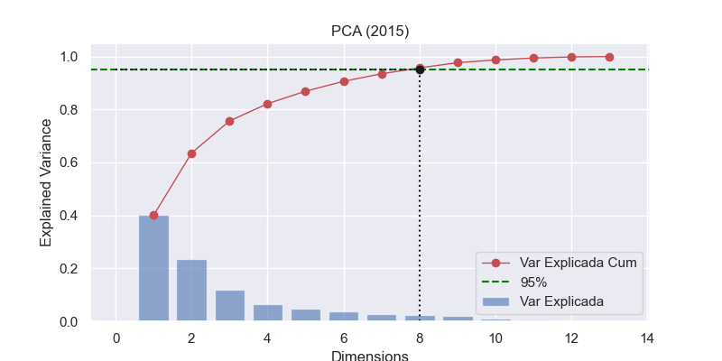
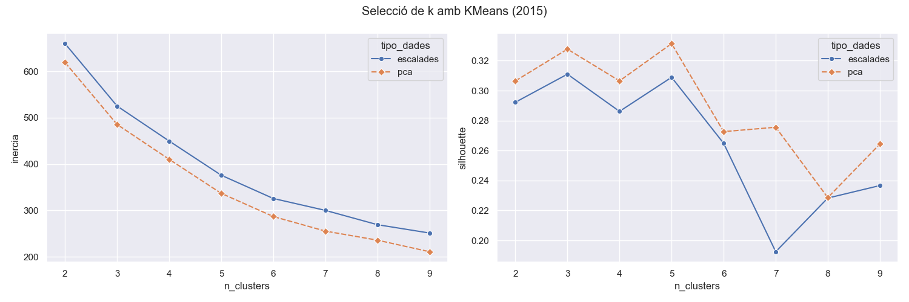

# Introducció
Treball de fi de Master centrat en la gentrificació als barris de Barcelona.
# Estructura del projecte
```bash
├── data
│   ├── raw
│   ├── processed
│   ├── dimensions
│   ├── modelling
├── notebooks
│   └── ingestio_demografiques.ipynb
│   └── ingestio_economiques.ipynb
│   └── ingestio_urbanes.ipynb
│   └── ingestio_habitatge.ipynb
│   └── feature_engineering.ipynb
│   └── eda.ipynb
│   └── modelling.ipynb
├── results
│   └── figs
├── src
│   └── utils.py
│   └── __init__.py
├── env
├── requirements.txt
├── README.md
├── LICENSE
└── .gitignore
```
# Fonts
S' han integrat diferents fonts de dades de tipologia socio econòmica i d' habitatge. En el procés d' ingesta i de preprocessament, s' han combinat per obtenir un dataset per construir el model de ML i un altre per enriquir l'anàlisi de dades.
## Dades Demogràfiques
- **Població Total per barri:**[Portal de dades Barcelona](https://portaldades.ajuntament.barcelona.cat/ca/microdades/2f6e0561-30f4-44a0-8446-e27442d4754c)
- **Població per nacionalitat (Espanya, Resta UE i Resta del món) per barri:** [Portal de dades de Barcelona](https://portaldades.ajuntament.barcelona.cat/ca/microdades/ae5116f1-b265-4602-9031-edd9a45f342b)
- **Població per regió de continent per barri:** [Portal de dades Barcelona](https://portaldades.ajuntament.barcelona.cat/ca/microdades/28c20408-5bce-41db-9b83-1b85ac9b2548)
- **Població per nivell d'estudis i nacionalitat (Espanya, Resta UE i Resta del Món) per barri:** [Portal de dades de Barcelona](https://portaldades.ajuntament.barcelona.cat/ca/microdades/67f811ef-a79e-4877-ae62-77148443aa69)
- **Població per grup d'edat i nacionalitat (Espanya, Resta UE i Resta del Món) per Barri:** [Portal de dades de Barcelona](https://portaldades.ajuntament.barcelona.cat/ca/microdades/4f9dbc34-4753-4bb8-b5a6-eece9db4ea71)
## Dades Econòmiques
- **Renda neta Mitjana per Persona i barri:** [Open Data](https://opendata-ajuntament.barcelona.cat/data/ca/dataset/renda-tributaria-per-persona-atlas-distribucio)
- **Index Gini per barri:** [Open Data](https://opendata-ajuntament.barcelona.cat/data/ca/dataset/atles-renda-index-gini)
## Dades Urbanes
- **Incidents per barri:** [Portal de dades Barcelona](https://portaldades.ajuntament.barcelona.cat/ca/microdades/8181e647-083e-48ec-b8a3-68b25b91ab83)
- **Nombre de locals comercials actius per sector d’activitat i grup d’activitat:**  [Portal de dades Barcelona](https://portaldades.ajuntament.barcelona.cat/ca/estad%C3%ADstiques/fsokzddxhd)
## Dades Habitatge
- **Preu mitjà per superfície (€/m²) del lloguer d'habitatges:** [Portal de dades Barcelona](https://portaldades.ajuntament.barcelona.cat/ca/estad%C3%ADstiques/5ibudgqbrb)
- **Nombre d’habitatges d’ús turístic:** [Portal de dades Barcelona](https://portaldades.ajuntament.barcelona.cat/ca/estad%C3%ADstiques/z1wuyvykvf)
- **Nombre dels locals d'habitatge segons superfície de la ciutat de Barcelona:** [Portal de dades Barcelona](https://portaldades.ajuntament.barcelona.cat/ca/microdades/e2424d15-fdb6-4bae-b7ac-4be2a9886790)
# EDA - Validació de les dades
Es realitza una exploració de les dades focalitzada en les seves estructures i distribucions. No s' ha posat el focus en un anàlisi descriptiva, ja que es durà a terme després d' aplicar els models de clustering. En aquest cas, en una primera iteració després de crear els conjunts de dades finals en el notebook [feature_engineering.ipynb](notebooks/feature_engineering.ipynb) s' ha executat el notebook [eda.ipynb](notebooks/eda.ipynb) i s' han detectat les següents problemàtiques:

|         aspecte        | estat    |   comentari                                                                |
|:-----------------------|---------:|----------------------------------------------------------------------------|
| df_2015 i df_2023          | valid |    No presenten nuls ni duplicats i mantenen una estructura sòlida per barri.     |
| df_deltes        | revisar |    Hi ha NaN i inf en variables calculades com a canvis percentuals sobre bases inicials nul.les o inexistents.     |
| Escala de variables   | revisar  |     Renda, gini, preu i taxes per 1000 hab treballen en escales diferents. Abans del clustering caldra escalar.    |
| Outliers | revisar |    Algunes variables urbanes presenten cues llargues i outliers.Valorar si aplicar transofrmació logaritmica.     |
| Correlacions | revisar |    Algunes variables presenten una forta correlació entre elles, com és el cas de import_euros i pct_universitaris (0.88), pct_joves i pct_pob_estrangera (0.9), delta_pct_universitaris i delta_pct_pob_estrangera_occidental (0.87).     |

Després de detectar els registres erronis en una primera execució del notebook [eda.ipynb](notebooks/eda.ipynb), s' han aplicat els canvis necessaris per tal de subsanar les dades. En aquest cas: 
- Creació de dues funcions per calcular els deltes de manera robusta i tenint en compte valors nuls o 0 que causin nuls o infinits.
- Tractament de valors nuls en els datasets [processats](data/processed/). Són registres en els que els valors no són equivocats ni no capturats, simplement no hi existeixen. És el cas de pisos turístics en zones menys turístiques, com per exemple a Torre Baró, on és molt probable que no hi hagi, i per tant esdevenen 0.

Un cop els canvis s' han aplicat, s' ha re-executat el notebook [eda.ipynb](notebooks/eda.ipynb) i s'obtenen els següents resultats resumits:

|         aspecte        | estat    |   comentari                                                                |
|:-----------------------|---------:|----------------------------------------------------------------------------|
| df_2015 i df_2023          | valid |    No presenten nuls ni duplicats i mantenen una estructura sòlida per barri.     |
| df_deltes        | revisat |    Amb una funció més robusta s'han calculat els deltes i ah permès tractar aquells registres amb denominador 0 o nul.     |
| Escala de variables   | revisat  |     L' estandarització de les dades es durà a terme en el notbook de modelatge.    |
| Outliers | revisat |    La transformació logarítmica (si escau) es valorarà en la part de modelatge.     |
| Correlacions | revisar |   Utilitzarem PCA per reduir dimensionalitat.    |


 # Modelatge
 ## Clusters 2015
 ### PCA (Principal component analysis)
 
 
 **Observacions:**
- Es pot observar que es necessiten els 5 principal components per explicar el 90% i 8 per explicar el 95%.
 ### Selecció de K
 
**Observacions:**
- El nombre de clusters òptim són 3 o 5 clusters, en ambdós casos s'obté un bon valor de silhouette, i es pot considerar el colze en el gràfic de la inèrcia. 
- El gràfic mostra també, que les dades amb pca aplicada, obtenen lleugerament millors resultats.